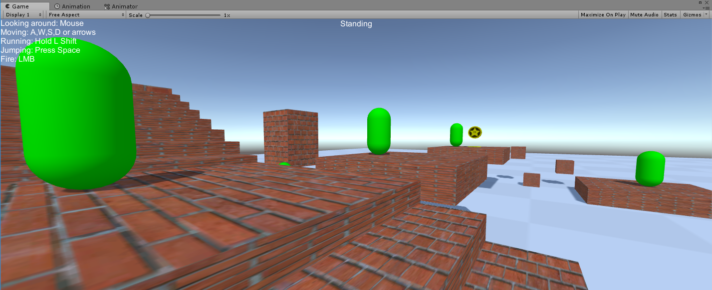

# SimpleFPS
Simple FPS functionality example requested during a recruitment process

Task: 
* Simple scene in Unity
* Simple 3D objects ( plane, cube etc.)

* Create simple level with corridor, stairs, cliff, moving platform
* Create player object (simple box), that can move freely around the level: walk, run, jump but cannot fall unless he jumps.
* Move the player with WSAD/arrow keys (forward/backwards, strafe), mouse (look around), space (jump)
* Powerups for player that gives +50% bonus to speed and jump height
* Simple GUI (simple text) showing current player status ( walking/running,jumping/...)
* Shooting system and transfering bullet dmg to the target that was hit

* Do not use nav mesh agent
* Do not use singletons not static classes
* Do not use Unity character controller

Bonus task:
* Player class should have the ablity to be extended by new possibilities ( flying or crouching) without changing the player class.
